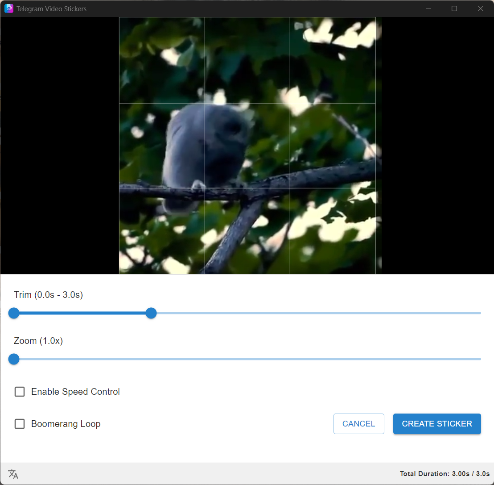

# Telegram Video Stickers

  

  <i>Vibe-coded with brain & edited with love</i> 😎

## Description

**Telegram Video Stickers** is a desktop application designed to easily create video stickers for Telegram that strictly
comply with the platform's technical requirements.

This application simplifies the process of converting, resizing, and encoding videos into the `.webm` (VP9) format
required for Telegram stickers, ensuring they meet the constraints for duration and dimensions.

### Supported Platforms

The application is available for:

- 🪟 **Windows**
- 🍎 **macOS**
- 🐧 **Linux**

### Supported Languages

- **English**
- **Russian**

## Features

  

- **Video Conversion**: Automatically converts video files to `.webm` format with VP9 codec.
- **Auto-Resizing**: Resizes videos to fit within the 512x512 pixel requirement while maintaining aspect ratio (one side
  512px, the other ≤ 512px).
- **Trimming**: Built-in editor to trim videos to the maximum allowed duration (3 seconds).
- **Boomerang Effect**: Create looping boomerang-style stickers from your videos.
- **Preview**: Real-time preview of the sticker before exporting.
- **Drag & Drop**: Simple drag-and-drop interface for importing files.
- **Duration Check**: Visual indicator for video duration to ensure compliance.
- **Multi-language Support**: Fully localized in English and Russian. Auto-detects system language.

## Technical Stack

This project is built using the following technologies:

- **Core**: [Electron](https://www.electronjs.org/), [React](https://react.dev/), [TypeScript](https://www.typescriptlang.org/), [Vite](https://vitejs.dev/)
- **UI Framework**: [Material UI (MUI)](https://mui.com/)
- **State Management**: [Zustand](https://docs.pmnd.rs/zustand)
- **Video Processing**: [FFmpeg](https://ffmpeg.org/) (via `fluent-ffmpeg` and `ffmpeg-static`)
- **Building & Packaging**: [Electron Builder](https://www.electron.build/)

## NPM Scripts

Here is a list of available npm scripts and their descriptions:

| Script         | Description                                                       |
| :------------- | :---------------------------------------------------------------- |
| `dev`          | Starts the development server with Electron and Vite.             |
| `build`        | Runs type checks and builds the application for production.       |
| `start`        | Previews the built application.                                   |
| `lint`         | Runs ESLint to check for code quality issues.                     |
| `lint:fix`     | Runs ESLint and automatically fixes fixable issues.               |
| `prettier:fix` | Formats all files using Prettier.                                 |
| `typecheck`    | Runs TypeScript type checking for both Node and Web environments. |
| `build:win`    | Builds the application for Windows (Portable).                    |
| `build:mac`    | Builds the application for macOS (DMG).                           |
| `build:linux`  | Builds the application for Linux (AppImage).                      |
| `postinstall`  | Installs app dependencies for Electron.                           |
